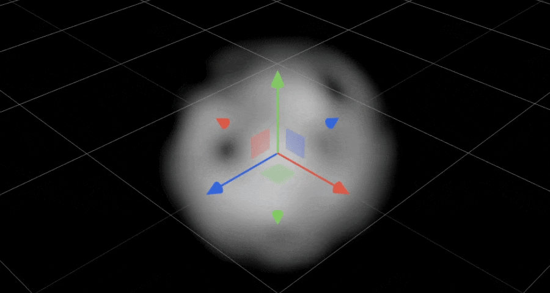

# TSL Experiments



This repository contains experiments using [TSL (Three.js Shader
Language)](https://github.com/mrdoob/three.js/wiki/Three.js-Shading-Language), a
currently Three.js exclusive way to write Shaders (programs that run on the GPU)
in JavaScript/TypeScript that has benefits over writing native GLSL/WGSL shader
programs:

- Tree-shakable
- No language switch TS <-> GLSL/WGSL
- Automatic shader graph optimizations
- Renderer agnostic
- Output to WebGL(2) or WebGPU
- Universal approach to vertex vs. fragment shader creation
- Node-based material system

## Background

Before TSL, to run custom shader code as part of a Three.js OOTB material you
would need to rely on
[`material.onBeforeCompile`](https://github.com/mrdoob/three.js/wiki/Three.js-Shading-Language#old)
and search-and-replace the shader code in order to insert your custom shader
code. Needless to say this is less than ideal and error-prone. Because shader
snippets are now inserted only if they're used and only once, you can compose
shaders much more easily, in most part enabled by the accompanying node-based
material system.

## First Thoughts

- It's _magic_ 🪄
- The type system isn't perfect yet and not as rigid as native GLSL/WGSL is
- More verbose than GLSL/WGSL
- Very easy to get into
- Interesting approach to [varyings](https://github.com/mrdoob/three.js/wiki/Three.js-Shading-Language#varying-node-name--null-)
- Swizzling is well implemented
- Highlights:
  - Ability to _compose_ shaders from multiple fragmental modules
  - Uniform declaration + update methods
  - Huge amount of available variables (`positionLocal`, `positionWorld`, `cameraPosition`, …)

## Install

```
pnpm i
```

## Run

```
pnpm dev
```
